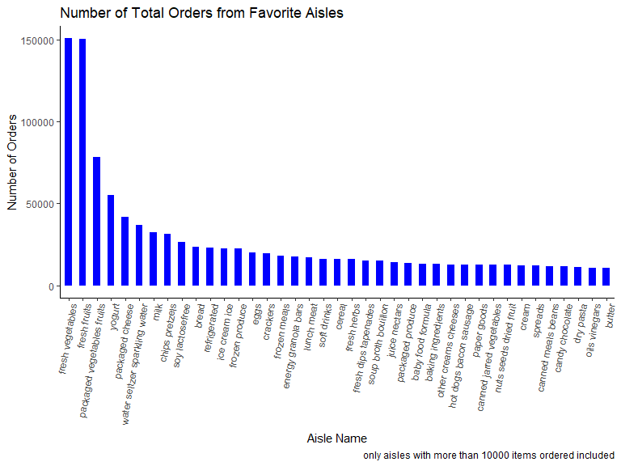
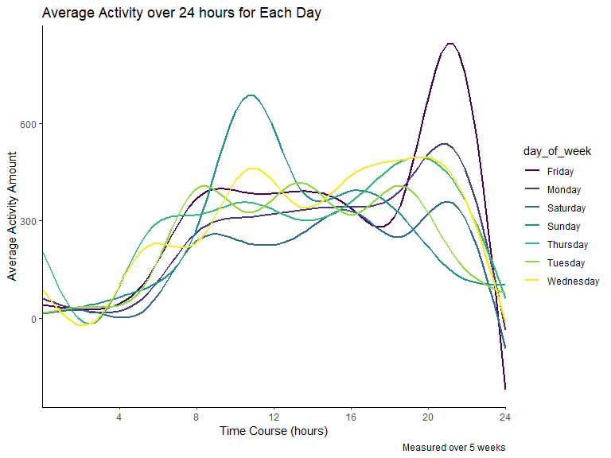
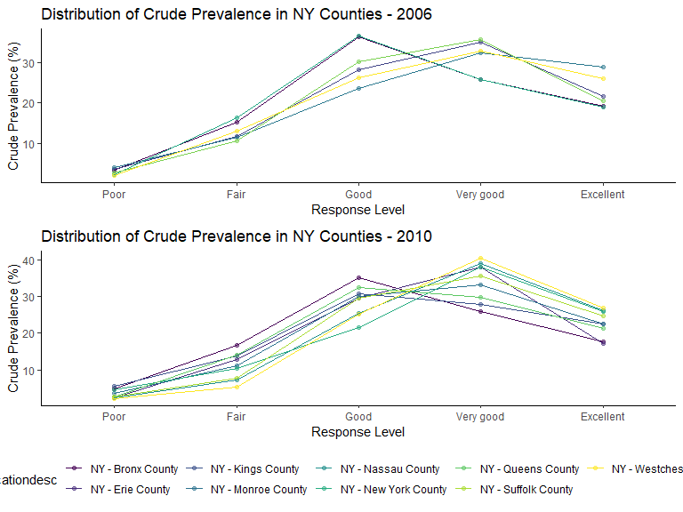
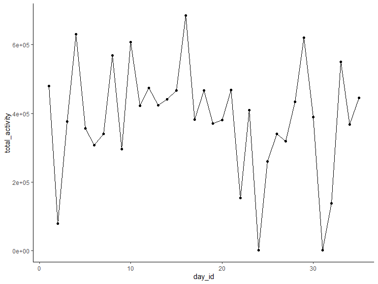

p8105\_hw3\_ha2546
================
Hana Akbarnejad
10/9/2019

## Problem1

``` r
library(p8105.datasets)
data("instacart")

instacart_desc = instacart %>% 
  filter(
    order_id == 112
  )
```

**Dataset Description**

In the first problem, we are interested in exploring the *instacart*
dataset. This dataset stores information about online grocery shopping
in 2017. The datset contains 1384617 observations of 131209 unique
orders of 39123 differennt products. There are 15 variables associated
with these rows such as *order\_dow* (the day of the week that the order
has been placed), *order\_hour\_of\_day* (the time of the day that the
order has been placed), *product\_name* (the item purchased), *aisle*
(the aisle that the item has chosen from), etc. For example, we can see
that ordere with *order\_id* 112 contained 11 items including Fresh
Cauliflower, I Heart Baby Kale, Sea Salt Baked Potato Chips from
produce, produce, snacks departments. These products has been chosen
from aisles 83, 123, 107 which are associated with the fresh vegetables,
packaged vegetables fruits, chips pretzels aisles, respectively. This
order has been placed on Thursday at 14, and 26 days after the pripr
order of this customer (with the customer ID: 125030).

**Parts a and b**

``` r
aisle_fav_n = instacart %>% 
  # group_by(aisle) %>% 
  count(aisle, name = "aisle_order_n") %>% 
  arrange(desc(aisle_order_n))

aisle_fav_plot = aisle_fav_n %>% 
  filter(aisle_order_n > 10000) %>% 
  ggplot(aes(x = reorder(aisle, -aisle_order_n), y = aisle_order_n)) +
  geom_bar(stat="identity", width=0.5, fill="blue") +
  theme(axis.text.x = element_text(angle = 80, hjust = 1)) +
  labs(
    title = "Number of Total Orders from Favorite Aisles",
    x = "Aisle Name",
    y = "Number of Orders",
    caption = "only aisles with more than 10000 items ordered included"
  )

aisle_fav_n
```

    ## # A tibble: 134 x 2
    ##    aisle                         aisle_order_n
    ##    <chr>                                 <int>
    ##  1 fresh vegetables                     150609
    ##  2 fresh fruits                         150473
    ##  3 packaged vegetables fruits            78493
    ##  4 yogurt                                55240
    ##  5 packaged cheese                       41699
    ##  6 water seltzer sparkling water         36617
    ##  7 milk                                  32644
    ##  8 chips pretzels                        31269
    ##  9 soy lactosefree                       26240
    ## 10 bread                                 23635
    ## # ... with 124 more rows

``` r
aisle_fav_plot
```



In this part, I wanted to figure out how many distinct aisles we have in
the dataset, and which were the favorite ones. So, I grouped the dtaset
by aisles, and understood that there are total of 134 different isles.
Then I counted the number of times that have been ordered from each
isle. By further arranging this column in descending order, I found the
most popular isles. Top five aisles with the most items ordered from are
fresh vegetables, fresh fruits, packaged vegetables fruits, yogurt,
packaged cheese, water seltzer sparkling water, milk, chips pretzels,
soy lactosefree, bread.I then made a plot that shows the number of items
ordered in each aisle (only for aisles with more than 10000 items
ordered). For this purpose I made the above bar plot that shows the
aisle names on x axis and the number of items ordered on y axis (note
that only aisles with more than 10000 items ordered included).

**Part c**

``` r
top3_items = instacart %>% 
  filter(aisle == c("baking ingredients", "dog food care", "packaged vegetables fruits")) %>% 
  group_by(aisle, product_name) %>%
  summarize(
    count = n()
    ) %>% 
  top_n(3, count) %>% 
  knitr::kable()

top3_items
```

| aisle                      | product\_name                                   | count |
| :------------------------- | :---------------------------------------------- | ----: |
| baking ingredients         | Light Brown Sugar                               |   157 |
| baking ingredients         | Organic Vanilla Extract                         |   122 |
| baking ingredients         | Pure Baking Soda                                |   140 |
| dog food care              | Organix Chicken & Brown Rice Recipe             |    13 |
| dog food care              | Organix Grain Free Chicken & Vegetable Dog Food |    14 |
| dog food care              | Original Dry Dog                                |     9 |
| packaged vegetables fruits | Organic Baby Spinach                            |  3324 |
| packaged vegetables fruits | Organic Blueberries                             |  1692 |
| packaged vegetables fruits | Organic Raspberries                             |  1920 |

In part c of problem 1 was focused on figuring out the top 3 items which
was ordered from aisles “baking ingredients”, “dog food care”, and
“packaged vegetables fruits”. I grouped the data by aisle and product
names, counted the number of times each item was ordered and presented
the result in the table above.

**Part d**

``` r
hours_days_products = instacart %>% 
  filter(product_name == c("Pink Lady Apples", "Coffee Ice Cream")) %>% 
  group_by(product_name, order_dow) %>% 
  summarize(
    hours_mean = mean(order_hour_of_day)
  ) %>% 
  pivot_wider(
    names_from = order_dow,
    values_from = hours_mean
  ) %>%
    rename(
      Sun = `0`, Mon = `1`, Tue = `2`, Wed = `3`, Thr = `4`, Fri = `5`, Sat = `6`
      ) %>% 
  knitr::kable(digits = 1)

hours_days_products
```

| product\_name    |  Sun |  Mon |  Tue |  Wed |  Thr |  Fri |  Sat |
| :--------------- | ---: | ---: | ---: | ---: | ---: | ---: | ---: |
| Coffee Ice Cream | 13.2 | 15.0 | 15.3 | 15.4 | 15.2 | 10.3 | 12.4 |
| Pink Lady Apples | 12.2 | 11.7 | 12.0 | 13.9 | 11.9 | 13.9 | 11.6 |

In the last part, I worked on the finding the mean hour of day at which
*Pink Lady Apples* and *Coffee Ice Cream* were ordered on each day of
the week. I made a table which is easy to grasp, with days of the week
as variables and mentioned products as rows, including the average hour
of day at which the items were ordered.

## Problem 2

In this part, I worked with *BRFSS* dataset. First, I cleaned the names
and made a subset of the data which is focused on the *Overall Health*,
then I transformed response levels as ordered factors from poor to
excellent.

``` r
data("brfss_smart2010") 

brfss_data = brfss_smart2010 %>% 
  janitor::clean_names() %>% 
  filter(topic == "Overall Health") %>% 
  mutate(
    response = factor(response, levels = c("Poor", "Fair", "Good", "Very good", "Excellent"), ordered = TRUE)
  )
```

On the next step, I needed to know which states has more or equal than 7
locations in both 2002 and 20010.

``` r
brfss_location_2002 = brfss_data %>%
  filter(year == "2002") %>% 
  group_by(locationabbr) %>% 
  summarize(
    distinct_location = n_distinct(locationdesc)
    ) %>% 
  filter(distinct_location >= 7)


brfss_location_2010 = brfss_data %>%
  filter(year == "2010") %>% 
  group_by(locationabbr) %>% 
  summarize(
    distinct_location = n_distinct(locationdesc)
    ) %>% 
  filter(distinct_location >= 7)
```

We observed that during 2002, there were 6 locations satissfying this
condition, and during 2010 this number was 14.

In this part, I made a subset of data from excellent responses, then I
summarized the mean of the data\_value variable in different US states
and then made a spagetti plot that shows the mean of crude prevalence
percentage ( *data\_value* ) against different years.

``` r
  brfss_exc = brfss_data %>%
  filter(
    response == "Excellent"
  ) %>%
  group_by(locationabbr, year) %>%
  summarize(
    mean_exc_location = mean(data_value)
  )

brfss_exc_spagetti = brfss_exc %>% 
  ggplot(aes(x = year, y = mean_exc_location, color = locationabbr)) +
  geom_line() +
    labs(
    title = "Average Crude Prevalence 2002 - 2010 among US States",
    x = "Year",
    y = "Average Crude Prevalence (%)",
    caption = "From BRFSS Excellent Responses")

brfss_exc_spagetti + labs(color = "STATES")
```



In this part, I made a panel plot for the data from 2006 and 2010,
focusing on the distribution of crude prevalence percentage for
different response levels (“Poor”, “Fair”, “Good”, “Very good”,
“Excellent”), among different counties of Ny State.

``` r
library("patchwork")

plot_2006 = brfss_data %>%
  filter(
    year == "2006",
    locationabbr == "NY"
  ) %>%
  group_by(locationdesc, response) %>%
  summarize(
    mean_value = mean(data_value)
  ) %>% 
  ggplot(aes(x = response, y = mean_value, color = locationdesc, group = locationdesc)) +
  geom_point(alpha = .5) +
  geom_line() +
  labs(
    title = "Distribution of Crude Prevalence in NY Counties - 2006",
    x = "Response Level",
    y = "Crude Prevalence (%)",
    caption = NULL
  ) +
  guides(color = FALSE, size = FALSE)


plot_2010 = brfss_data %>%
  filter(
    year == "2010",
    locationabbr == "NY"
  ) %>%
  group_by(locationdesc, response) %>%
  summarize(
    mean_value = mean(data_value)
  ) %>% 
  ggplot(aes(x = response, y = mean_value, color = locationdesc, group = locationdesc)) +
  geom_point(alpha = .5) +
  geom_line() +
  labs(
    title = "Distribution of Crude Prevalence in NY Counties - 2010",
    x = "Response Level",
    y = "Crude Prevalence (%)",
    caption = NULL
  ) +
  theme(legend.position = "bottom")


(plot_2006 / plot_2010)
```



## Problem 3

``` r
accel_data = read_csv("./data/accel_data.csv") 
```

    ## Parsed with column specification:
    ## cols(
    ##   .default = col_double(),
    ##   day = col_character()
    ## )

    ## See spec(...) for full column specifications.

``` r
accel_data_tidy = accel_data %>% 
  janitor::clean_names() %>% 
  pivot_longer(
    cols = activity_1:activity_1440,
    names_to = "activity_number",
    values_to = "value",
    names_prefix = "activity_"
  ) %>%
  select(activity_number, week, day, day_id, value) %>% 
  mutate(
    is_weekend = (day == "Saturday" | day == "Sunday")
  )

accel_data_tidy
```

    ## # A tibble: 50,400 x 6
    ##    activity_number  week day    day_id value is_weekend
    ##    <chr>           <dbl> <chr>   <dbl> <dbl> <lgl>     
    ##  1 1                   1 Friday      1  88.4 FALSE     
    ##  2 2                   1 Friday      1  82.2 FALSE     
    ##  3 3                   1 Friday      1  64.4 FALSE     
    ##  4 4                   1 Friday      1  70.0 FALSE     
    ##  5 5                   1 Friday      1  75.0 FALSE     
    ##  6 6                   1 Friday      1  66.3 FALSE     
    ##  7 7                   1 Friday      1  53.8 FALSE     
    ##  8 8                   1 Friday      1  47.8 FALSE     
    ##  9 9                   1 Friday      1  55.5 FALSE     
    ## 10 10                  1 Friday      1  43.0 FALSE     
    ## # ... with 50,390 more rows

DESCRIBE IT

``` r
total_activity_table = accel_data_tidy %>% 
  group_by(day_id) %>% 
  summarise(
    total_activity = sum(value)
  )

total_activity_plot = total_activity_table %>% 
  ggplot(aes(x = day_id, y = total_activity)) +
  geom_point() + 
  geom_line()

total_activity_table
```

    ## # A tibble: 35 x 2
    ##    day_id total_activity
    ##     <dbl>          <dbl>
    ##  1      1        480543.
    ##  2      2         78828.
    ##  3      3        376254 
    ##  4      4        631105 
    ##  5      5        355924.
    ##  6      6        307094.
    ##  7      7        340115.
    ##  8      8        568839 
    ##  9      9        295431 
    ## 10     10        607175 
    ## # ... with 25 more rows

``` r
total_activity_plot
```


Describe Trends

``` r
activity_day_amount = accel_data_tidy %>% 
  mutate(
    activity_number = as.numeric(as.character(activity_number))
  ) %>% 
  group_by(day, activity_number) %>% 
  summarize(
    mean_activity_day = mean(value)
  ) %>% 
  ggplot(aes(x = activity_number, y = mean_activity_day, color = day, group = day)) +
  geom_smooth(se = FALSE) +
  labs(
    title = "Average Activity over 24 hours for Each Day",
    x = "Time Course (hours)",
    y = "Average Activity Amount",
    caption = "Measured over 5 weeks"
  ) +
  scale_x_discrete(limit = c(240, 480, 720, 960, 1200, 1440),
                   labels = c("4", "8", "12", "16", "20", "24"))

activity_day_amount
```

    ## `geom_smooth()` using method = 'gam' and formula 'y ~ s(x, bs = "cs")'


