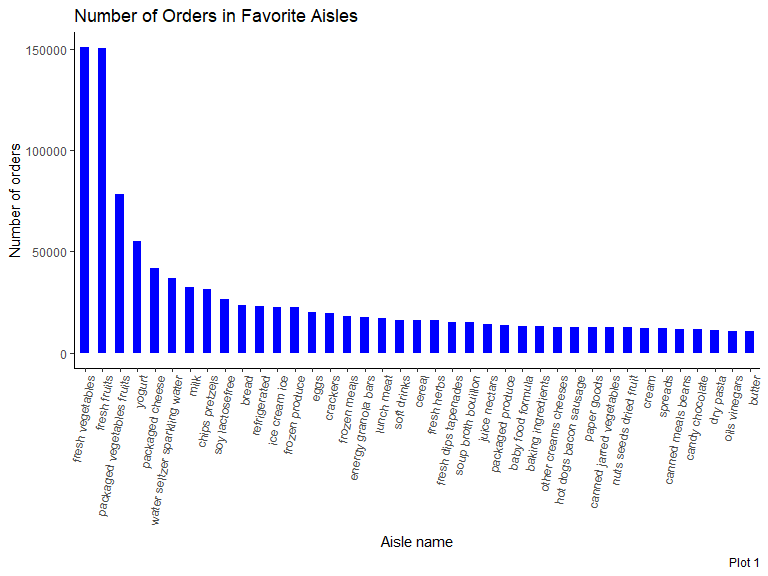

p8105\_hw3\_ha2546
================
Hana Akbarnejad
10/9/2019

# Problem1

How many aisles are there, and which aisles are the most items ordered
from? I grouped the dtaset by the aisles, and understood that there are
total of 134 different isles. Then I counted the number of times items
have been ordered from each isle. By further arranging this column in
descending order, I found the most popular isles. Top five aisles with
the most items ordered from are fresh vegetables, fresh fruits, packaged
vegetable fruits, yogurt, packaged cheese.I then made a plot that shows
the number of items ordered in each aisle (only for aisles with more
than 10000 items ordered). For this purpose I made a bar plot that shows
the aisle names on x axis and the number of items ordered on y axis.

**should we arrange the columns from most to least? how?**

``` r
library(p8105.datasets)
data("instacart")

aisle_fav_n = instacart %>% 
  group_by(aisle) %>% 
  count(aisle, name = "aisle_order_n") %>% 
  arrange(desc(aisle_order_n))

aisle_fav_plot = aisle_fav_n %>% 
  filter(aisle_order_n > 10000) %>% 
  ggplot(aes(x = aisle, y = aisle_order_n)) +
  geom_bar(stat="identity", width=0.5, color="blue", fill="white") +
  theme(axis.text.x = element_text(angle = 90, hjust = 1)) +
  labs(
    title = "Number of Orders in Favorite Aisles",
    x = "Aisle name",
    y = "Number of orders",
    caption = "Plot 1"
  )

aisle_fav_n
```

    ## # A tibble: 134 x 2
    ## # Groups:   aisle [134]
    ##    aisle                         aisle_order_n
    ##    <chr>                                 <int>
    ##  1 fresh vegetables                     150609
    ##  2 fresh fruits                         150473
    ##  3 packaged vegetables fruits            78493
    ##  4 yogurt                                55240
    ##  5 packaged cheese                       41699
    ##  6 water seltzer sparkling water         36617
    ##  7 milk                                  32644
    ##  8 chips pretzels                        31269
    ##  9 soy lactosefree                       26240
    ## 10 bread                                 23635
    ## # ... with 124 more rows

``` r
aisle_fav_plot
```


